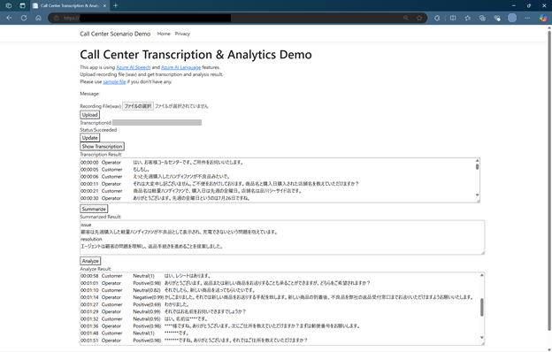

# Call Center Analytics App by Azure AI Speech and Language services

コールセンターなど、オペレーターとお客様の会話を録音したデータを用いて、文字起こしを行い、内容の分析や感情分析を行います。

This app analyze voice data recorded which operator and customer communicated; It enables to auto-analytics with

- conversation transcription operator and customer seperately (from one channel recording)
- extract issues and solution raised and made in conversation
- sentiment analysis in conversation

