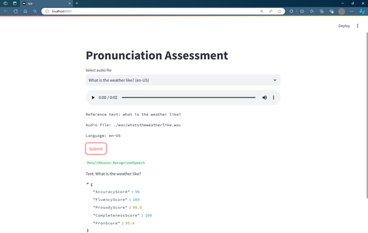

# Azure AI Speech Service : Pronunciation Assessment Demo sample (Python)

## Jupyter Notebook (assessment.ipynb)

Jupyter Notebook for short audio and long audio.

Set your Azure AI Speech key and region.

## Streamlit app (app.py)

Streamlit app using samples in wav folder (short audio & long audio, en-US & ja-JP).

Set your Azure AI Speech key and region in assessment.py, and run from console: `streamlit run app.py`

