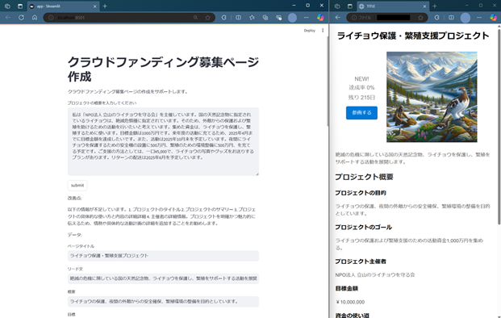

# Website Creator powered by Azure OpenAI Service

こちらのアプリでは、生成AIを用いて Web サイト作成に必要な情報を抽出、生成します。
サンプルとして、クラウドファンディングの Web サイト作成の際に、プロジェクト概要を入力することで、必要な情報や改善点のフィードバックを行い、Web サイト作成に必要な要素を抽出、生成します。また、プロジェクト概要からトップバナー画像を生成します。

This create website contents using Azure OpenAI models from user input.
As as sample, it creates crowd funding website from project summary as below functions:

- give you feedback which info should be added for better crowd funding
- extract website-ready contents from summary
- generate top banner image from summary

